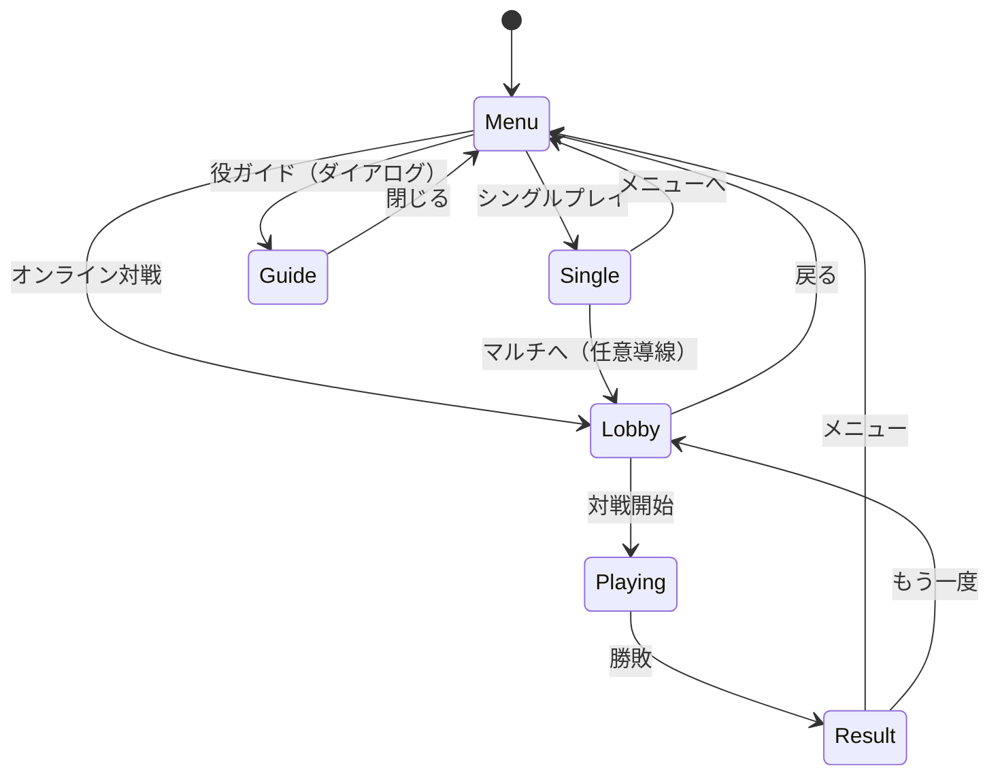

# 基本設計

## 画面遷移



画面状態は `app/page.tsx` の `GameMode` で管理します。

```typescript
type GameMode = 'menu' | 'single' | 'multiplayer-lobby' | 'multiplayer-game';
```

マルチプレイ中の表示は `useMultiplayerStore` の `status === 'playing'` と組み合わせて判定します。

---

## 画面一覧

| 画面 | コンポーネント | 説明 |
|------|----------------|------|
| メインメニュー | `app/page.tsx` | モード選択・ルール概要 |
| シングルプレイ | `single-player.tsx` | 盤面・操作・統計・消去履歴 |
| ロビー | `multiplayer-lobby.tsx` | 接続、ルーム作成/参加/観戦、チャット |
| 対戦 | `multiplayer-game.tsx` | 自盤 + 相手プレビュー + 戦績レポートDL |
| 役ガイド | `yaku-guide.tsx` | `YAKU_DEFINITIONS` の表示 |
| 結果 | `page.tsx` 内 Dialog | 勝利/敗北・レポートダウンロードボタン |

---

## ゲームルール（実装仕様）

### ボード

- サイズ: **7 列 × 14 行**（`game-engine.ts` の `BOARD_WIDTH` / `BOARD_HEIGHT`）
- 牌生成: 数牌 70%、字牌 30%

### 消去条件

1. **刻子**: 同一牌 3 枚以上が隣接（縦・横・斜め、L/T/鍵型含む）
2. **順子**: 同スートの連続数牌 3 枚以上が隣接（縦・横・斜め、L/T/鍵型含む）
   - 数字の並び順は問わない（3,1,2 でも消える）
   - 重複なし（各数字は 1 枚のみ）
   - 重複がある場合は重複しない部分集合が消える

### 落下・操作

- 左右移動、ソフトドロップ（tick）、ハードドロップ
- 配置後: 消去判定 → 重力 → 連鎖繰り返し
- 最上行に牌が置けなくなったらゲームオーバー

### ドラ

- `doraIndicator` / `uraDoraIndicator` から `getDoraTile` でドラ牌を算出
- 消去牌にドラが含まれると得点ボーナス（ドラ +50、裏ドラ +100）

### ガベージ（対戦）

- 消去結果に応じて `calculateGarbage` で送信量を算出
- 相手の `garbageQueue` に追加（`addGarbageTiles`）
- サーバー経由で同期（`queueGarbage` → `match:state` ブロードキャスト）

---

## 役（Yaku）

定義は `lib/yaku-data.ts` の `YAKU_DEFINITIONS`。カテゴリ:

| カテゴリ | 例 |
|----------|-----|
| `triplet` / `sequence` | 刻子、順子 |
| `honor` | 三元牌、風牌 |
| `special` | 対々和、一気通貫、断么九、老頭牌 |
| `yakuman` | 大三元、四喜和、国士無双 等 |
| `basic` | 連鎖ボーナス |

検出ロジックは `game-engine.ts` 内で消去グループと盤面状態から判定します。役追加時は **yaku-data と engine の両方** を更新してください。

---

## 状態モデル

### GameState（`mahjong-types.ts` / `game-store.ts`）

| フィールド | 説明 |
|------------|------|
| `board` | 盤面 |
| `currentTile` / `nextTile` | 操作中・次の牌 |
| `doraIndicator` / `uraDoraIndicator` | ドラ表示 |
| `score`, `level`, `combo`, `maxCombo` | 進行・得点 |
| `garbageQueue` | 受信待ちガベージ |
| `isGameOver`, `isPaused` | 終了・一時停止 |
| `lastYaku`, `clearHistory` | 直近役・消去履歴（全件保持） |

### MultiplayerStore（`multiplayer-store.ts`）

| フィールド | 説明 |
|------------|------|
| `status` | `disconnected` → `connecting` → `connected` → `in-room` → `playing` / `spectating` |
| `playerId`, `playerName`, `sessionToken` | セッション情報 |
| `role` | `player` / `spectator` / `null` |
| `currentRoom`, `availableRooms` | ルーム |
| `messages` | チャット（最大 50 件保持） |
| `matchSnapshot` | 対戦スナップショット（全プレイヤーの GameState） |
| `lastGameOver` | 直近の対戦結果（戦績レポート生成に使用） |
| `error` | エラーメッセージ |

---

## マルチプレイ設計

### セッション管理

- セッショントークン: `randomBytes(32).toString('hex')` = 64 文字
- TTL: 24 時間（最終アクセスから）
- クライアント: `localStorage` に保存、リロード時に `session:resume` で復元
- サーバー: メモリのみ管理（DB 不使用）

### ルーム構成

- プレイヤー: 最大 2 人
- 観戦者: 最大 20 人
- ホスト: ルーム作成者（退出時は次のプレイヤーに自動移譲）

### ゲームフロー

```
接続 → セッション作成 → ルーム作成/参加 → 準備完了 → 対戦開始
→ ゲーム入力（move-left/right/soft-drop/hard-drop）
→ サーバーで状態更新 → match:state ブロードキャスト
→ ゲームオーバー → match:ended → 戦績レポート生成
```

### 切断・再接続

```
disconnect → markDisconnected → player.isConnected = false → room:updated
reconnect → session:resume → bindSocket → reconnectMember → room:updated / match:state 再送
```

Socket.IO 自動再接続: 最大 8 回、初回 1 秒・最大 8 秒の指数バックオフ

---

## 戦績レポート

対戦終了後にクライアントサイドで JSON を生成してダウンロード。

```typescript
interface BattleReport {
  schemaVersion: "1.0";
  roomId: string;
  roomName: string;
  startedAt: string;   // ISO 8601
  endedAt: string;     // ISO 8601
  winnerName: string;
  players: Array<{
    playerName: string;
    score: number;
    isWinner: boolean;
  }>;
}
```

- ファイル名: `paijang-battle-{roomId}-{YYYYMMDD}.json`
- 個人情報（IP アドレス・メールアドレス等）は含めない
- DB への永続化なし（クライアントサイド生成のみ）

---

## エラーコード一覧

| コード | 説明 | クライアント対応 |
|--------|------|----------------|
| `INVALID_NAME` | 名前バリデーション失敗 | エラーメッセージ表示 |
| `RATE_LIMITED` | レート制限超過 | エラーメッセージ表示 |
| `UNAUTHORIZED` | セッション無効・権限なし | 再接続フローへ誘導 |
| `SESSION_EXPIRED` | セッション期限切れ | localStorage 削除 → 新規接続 |
| `ROOM_NOT_FOUND` | ルームが存在しない | ルーム一覧に戻る |
| `ROOM_FULL` | プレイヤー上限（2人） | エラーメッセージ表示 |
| `SPECTATORS_FULL` | 観戦者上限（20人） | エラーメッセージ表示 |
| `ALREADY_IN_ROOM` | 既に別ルームに在室 | 退出を促す |
| `NOT_HOST` | ホスト権限なし | エラーメッセージ表示 |
| `NOT_READY` | 準備未完了 | 準備状態確認を促す |
| `GAME_IN_PROGRESS` | 対戦中 | 観戦を提案 |
| `INVALID_INPUT` | 不正なゲーム入力 | 無視（クライアント側で防止） |

---

## API

現状 REST / GraphQL API はありません。将来のランキング・認証等は別途設計します。
