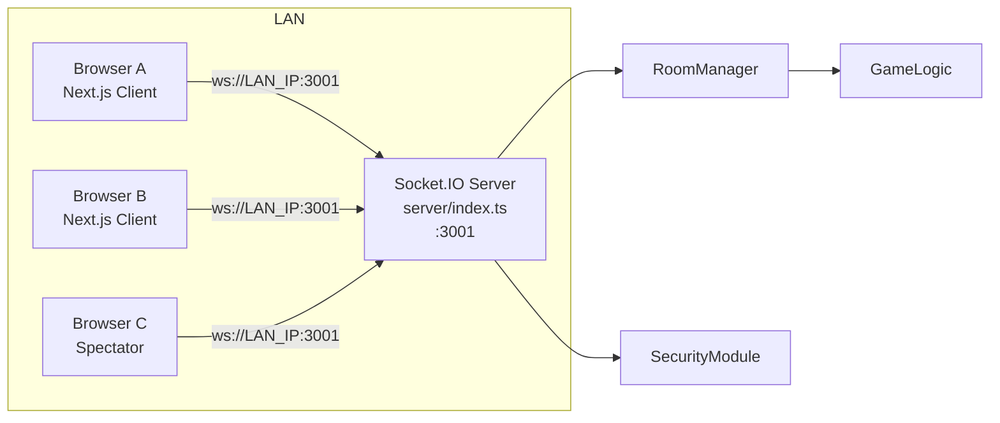
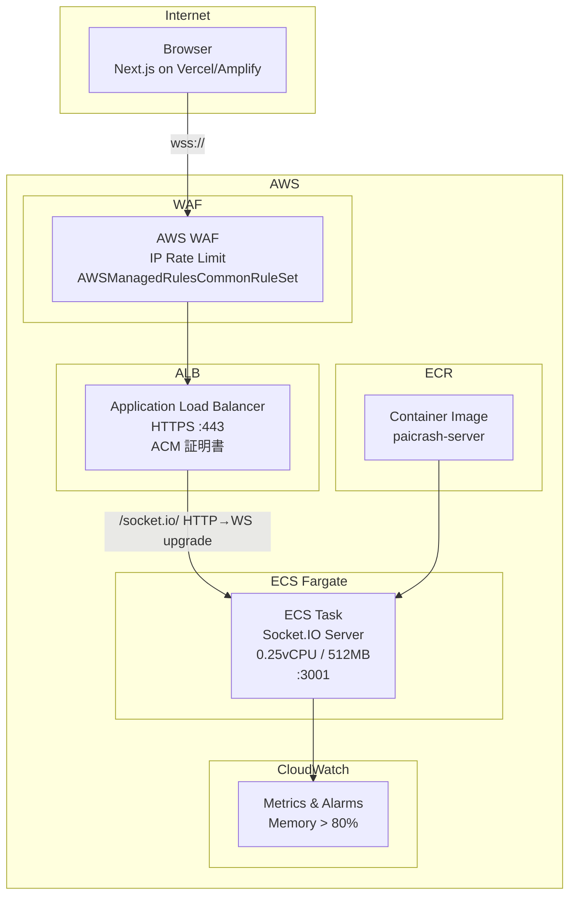
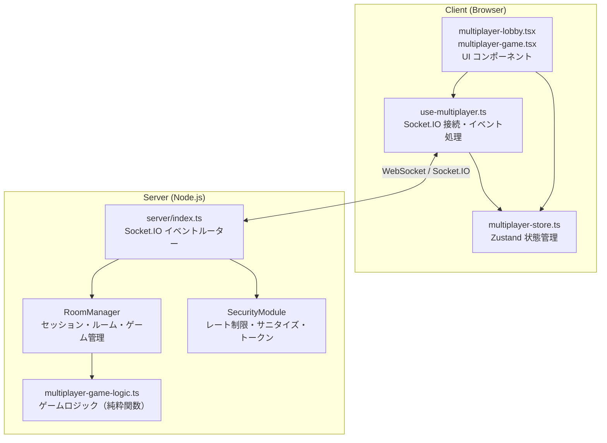
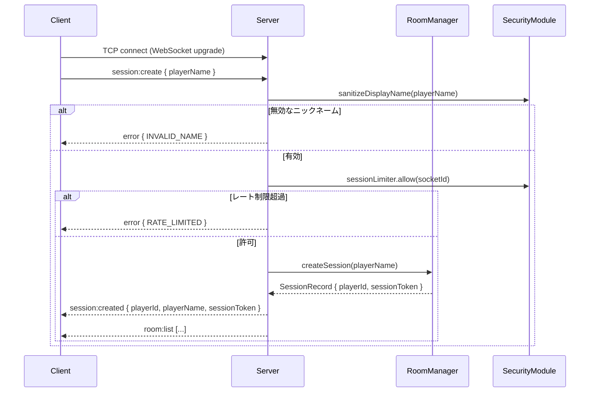
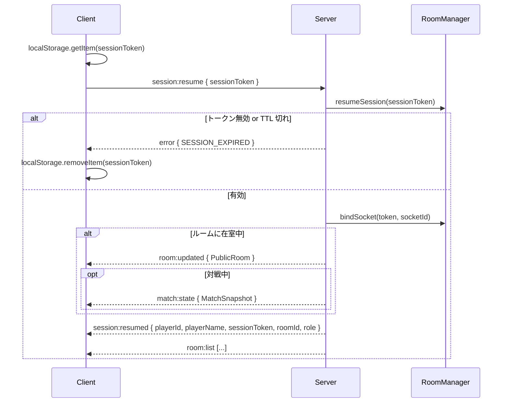
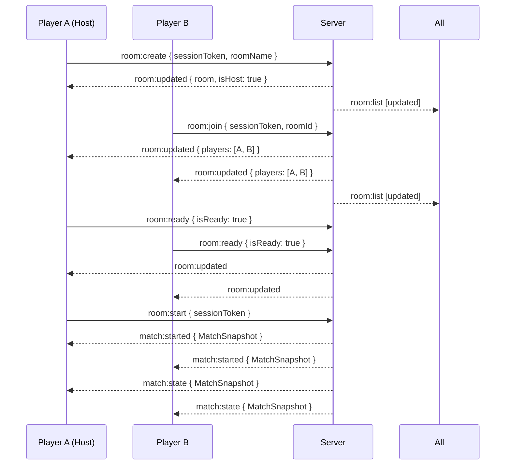
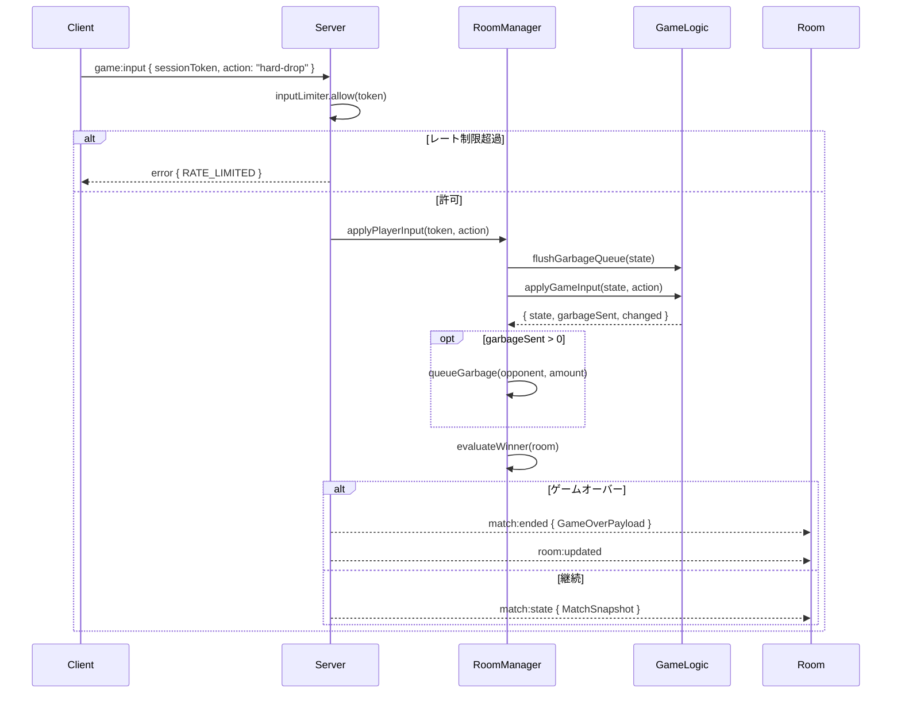
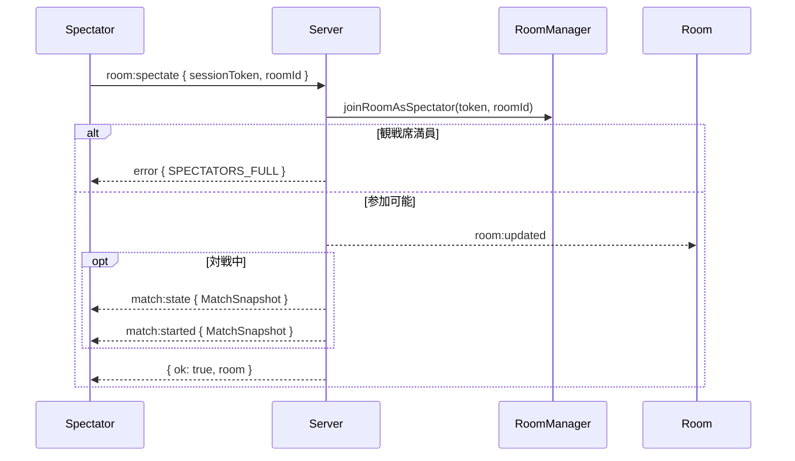

# Design Document: Online Multiplayer (online-multiplayer)

## Overview

paicrash のオンライン対戦機能は、既存の Socket.IO サーバー実装を AWS 本番環境へデプロイし、
ローカル LAN とインターネット越しの両方で同一クライアントコードで動作させるシステムである。

主な責務：
- 匿名セッション管理（ニックネームのみ、DB 不使用）
- 2 人制リアルタイム対戦（サーバー権威型ゲームロジック）
- 観戦モード（最大 20 人）
- ルーム内チャット
- 戦績レポートのクライアントサイド生成
- AWS ECS Fargate + ALB + WAF による本番インフラ（CDK で管理）

### 設計方針

| 方針 | 内容 |
|------|------|
| サーバー権威型 | ゲーム状態はサーバーのみが保持・更新する |
| ステートレス DB | セッション・ルームはサーバーメモリのみ（Redis 不使用） |
| 単一インスタンス | ECS desired count: 1（スケールアウト非対応） |
| 環境変数切り替え | `NEXT_PUBLIC_SOCKET_URL` / `ALLOWED_ORIGINS` のみで LAN ↔ AWS を切り替え |
| IaC | AWS CDK (TypeScript) で全インフラを管理 |

---

## Architecture

### ローカル LAN 環境




### AWS 本番環境



**通信フロー：**
1. ブラウザ → WAF（IP レート制限・共通ルール適用）
2. WAF → ALB（HTTPS 443、ACM 証明書で TLS 終端）
3. ALB → ECS Task（HTTP/WebSocket、ターゲットグループ stickiness 有効）
4. ECS Task → CloudWatch（メモリ使用量メトリクス）

---

## Components and Interfaces

### コンポーネント責務



### 各コンポーネントの境界

| コンポーネント | 責務 | 依存 |
|---------------|------|------|
| `server/index.ts` | Socket.IO イベントのルーティング、ブロードキャスト | RoomManager, SecurityModule |
| `RoomManager` | セッション CRUD、ルーム CRUD、ゲームティック、勝敗判定 | GameLogic, SecurityModule |
| `SecurityModule` | 入力サニタイズ、トークン生成、レート制限、CORS オリジン解析 | node:crypto |
| `multiplayer-game-logic.ts` | 純粋関数によるゲーム状態変換（副作用なし） | mahjong-types, game-engine |
| `use-multiplayer.ts` | Socket.IO クライアント管理、イベント→Store 変換 | socket.io-client, multiplayer-store |
| `multiplayer-store.ts` | クライアント UI 状態（Zustand） | multiplayer-protocol |

### Socket.IO イベント一覧

#### Client → Server

| イベント | ペイロード | 説明 |
|---------|-----------|------|
| `session:create` | `{ playerName }` | 新規セッション作成 |
| `session:resume` | `{ sessionToken }` | セッション復元 |
| `room:create` | `{ sessionToken, roomName }` | ルーム作成 |
| `room:join` | `{ sessionToken, roomId }` | プレイヤー参加 |
| `room:spectate` | `{ sessionToken, roomId }` | 観戦参加 |
| `room:leave` | `{ sessionToken }` | ルーム退出 |
| `room:ready` | `{ sessionToken, isReady }` | 準備状態変更 |
| `room:start` | `{ sessionToken }` | 対戦開始（ホストのみ） |
| `chat:send` | `{ sessionToken, text }` | チャット送信 |
| `game:input` | `{ sessionToken, action }` | ゲーム入力 |

#### Server → Client

| イベント | ペイロード | 説明 |
|---------|-----------|------|
| `session:created` | `SessionInfo` | セッション作成完了 |
| `session:resumed` | `SessionInfo + roomId + role` | セッション復元完了 |
| `room:list` | `PublicRoomListItem[]` | ルーム一覧更新 |
| `room:updated` | `PublicRoom` | ルーム状態更新 |
| `chat:message` | `ChatMessagePayload` | チャットメッセージ |
| `match:started` | `MatchSnapshot` | 対戦開始 |
| `match:state` | `MatchSnapshot` | ゲーム状態更新 |
| `match:ended` | `GameOverPayload` | 対戦終了 |
| `error` | `{ code, message }` | エラー通知 |


---

## WebSocket Event Flows

### 接続・セッション確立フロー



### セッション復元フロー（ブラウザリロード）



### ルーム作成・参加・対戦開始フロー



### 対戦中ゲーム入力フロー



### 観戦参加フロー



---

## Data Models

### SessionRecord（サーバーメモリ）

```typescript
interface SessionRecord {
  playerId: string;        // "player-{8hex}"
  playerName: string;      // 2〜16文字、サニタイズ済み
  sessionToken: string;    // randomBytes(32).toString('hex') = 64文字
  socketId: string | null; // 現在の Socket.IO 接続 ID
  roomId: string | null;   // 在室中のルーム ID
  role: 'player' | 'spectator' | null;
  createdAt: number;       // Unix ms
  lastSeenAt: number;      // Unix ms（TTL 判定に使用）
}
```

### InternalRoom（サーバーメモリ）

```typescript
interface InternalRoom {
  id: string;              // "room-{8hex}"
  name: string;            // 2〜32文字、サニタイズ済み
  hostId: string;          // ホストの playerId
  players: Map<string, RoomPlayer>;    // 最大 2 人
  spectators: Map<string, RoomSpectator>; // 最大 20 人
  maxSpectators: number;   // 20
  isStarted: boolean;
  createdAt: number;
  winnerId: string | null;
  startedAt: number | null;
  tickHandles: Map<string, NodeJS.Timeout>; // プレイヤーごとの自動落下タイマー
}
```

### BattleReport（クライアントサイド生成 JSON）

```typescript
interface BattleReport {
  schemaVersion: "1.0";
  roomId: string;
  roomName: string;
  startedAt: string;       // ISO 8601
  endedAt: string;         // ISO 8601
  winnerName: string;
  players: Array<{
    playerName: string;    // ニックネームのみ（個人情報なし）
    score: number;
    isWinner: boolean;
  }>;
}
```

**ファイル名形式：** `paicrash-battle-{roomId}-{YYYYMMDD}.json`

### ChatMessagePayload（プロトコル型）

```typescript
interface ChatMessagePayload {
  id: string;              // "msg-{8hex}"
  playerId: string;
  playerName: string;
  text: string;            // 1〜200文字、制御文字除去済み
  timestamp: number;       // Unix ms
  role: 'player' | 'spectator' | 'system';
}
```

### レート制限設定

| リミッター | 上限 | ウィンドウ | 対象 |
|-----------|------|-----------|------|
| `sessionLimiter` | 10 回 | 60 秒 | セッション作成（socket.id 単位） |
| `chatLimiter` | 20 回 | 60 秒 | チャット送信（sessionToken 単位） |
| `inputLimiter` | 120 回 | 10 秒 | ゲーム入力（sessionToken 単位） |


---

## AWS Infrastructure (CDK)

### CDK スタック分割方針

```
cdk/
├── bin/
│   └── app.ts              # CDK App エントリポイント
├── lib/
│   ├── infra-stack.ts      # InfraStack: VPC, ECR, ACM, WAF
│   └── app-stack.ts        # AppStack: ECS, ALB, CloudWatch Alarms
└── cdk.json
```

**InfraStack**（変更頻度低）：
- VPC（パブリックサブネット 2AZ）
- ECR リポジトリ（`paicrash-server`）
- ACM 証明書（ドメイン検証）
- WAF WebACL（ALB アタッチ用）

**AppStack**（デプロイ頻度高）：
- ECS Cluster + Fargate Service
- ALB + HTTPS リスナー + ターゲットグループ
- CloudWatch Alarms（メモリ使用率 > 80%）
- ECS タスク定義（環境変数参照）

### InfraStack 設計

```typescript
// cdk/lib/infra-stack.ts（概要）
export class InfraStack extends Stack {
  public readonly vpc: Vpc;
  public readonly repository: Repository;
  public readonly certificate: Certificate;
  public readonly webAcl: CfnWebACL;

  constructor(scope: Construct, id: string, props: StackProps) {
    // VPC: パブリックサブネット 2AZ、NAT Gateway なし（コスト削減）
    this.vpc = new Vpc(this, 'Vpc', {
      maxAzs: 2,
      natGateways: 0,
      subnetConfiguration: [{ subnetType: SubnetType.PUBLIC, name: 'Public' }],
    });

    // ECR
    this.repository = new Repository(this, 'ServerRepo', {
      repositoryName: 'paicrash-server',
      removalPolicy: RemovalPolicy.RETAIN,
    });

    // ACM（us-east-1 ではなく ALB と同リージョン）
    this.certificate = new Certificate(this, 'Cert', {
      domainName: 'your-domain.example.com',
      validation: CertificateValidation.fromDns(),
    });

    // WAF WebACL
    this.webAcl = new CfnWebACL(this, 'WebAcl', {
      scope: 'REGIONAL',
      defaultAction: { allow: {} },
      rules: [
        {
          name: 'IpRateLimit',
          priority: 1,
          action: { block: {} },
          statement: {
            rateBasedStatement: {
              limit: 2000,
              aggregateKeyType: 'IP',
            },
          },
          visibilityConfig: { /* ... */ },
        },
        {
          name: 'AWSManagedRulesCommonRuleSet',
          priority: 2,
          overrideAction: { none: {} },
          statement: {
            managedRuleGroupStatement: {
              vendorName: 'AWS',
              name: 'AWSManagedRulesCommonRuleSet',
            },
          },
          visibilityConfig: { /* ... */ },
        },
      ],
    });
  }
}
```

### AppStack 設計

```typescript
// cdk/lib/app-stack.ts（概要）
export class AppStack extends Stack {
  constructor(scope: Construct, id: string, props: AppStackProps) {
    // ECS Cluster
    const cluster = new Cluster(this, 'Cluster', { vpc: props.vpc });

    // タスク定義（0.25 vCPU / 512 MB）
    const taskDef = new FargateTaskDefinition(this, 'TaskDef', {
      cpu: 256,
      memoryLimitMiB: 512,
    });

    taskDef.addContainer('Server', {
      image: ContainerImage.fromEcrRepository(props.repository, 'latest'),
      portMappings: [{ containerPort: 3001 }],
      environment: {
        PORT: '3001',
        ALLOWED_ORIGINS: 'https://your-frontend.vercel.app',
      },
      logging: LogDrivers.awsLogs({ streamPrefix: 'paicrash-server' }),
    });

    // Fargate Service（desired: 1）
    const service = new FargateService(this, 'Service', {
      cluster,
      taskDefinition: taskDef,
      desiredCount: 1,
      assignPublicIp: true, // NAT Gateway なしのため
    });

    // ALB
    const alb = new ApplicationLoadBalancer(this, 'Alb', {
      vpc: props.vpc,
      internetFacing: true,
    });

    // HTTPS リスナー（WebSocket stickiness 有効）
    const listener = alb.addListener('Https', {
      port: 443,
      certificates: [props.certificate],
    });

    listener.addTargets('EcsTarget', {
      port: 3001,
      protocol: ApplicationProtocol.HTTP,
      targets: [service],
      stickinessCookieDuration: Duration.hours(1), // WebSocket セッション維持
      healthCheck: { path: '/', healthyHttpCodes: '200' },
    });

    // WAF を ALB にアタッチ
    new CfnWebACLAssociation(this, 'WafAssoc', {
      resourceArn: alb.loadBalancerArn,
      webAclArn: props.webAcl.attrArn,
    });

    // CloudWatch Alarm（メモリ > 80%）
    new Alarm(this, 'MemoryAlarm', {
      metric: service.metricMemoryUtilization(),
      threshold: 80,
      evaluationPeriods: 2,
      alarmDescription: 'ECS memory > 80%',
    });
  }
}
```

---

## Dockerfile Design

マルチステージビルドで本番イメージに `devDependencies` を含めない。

```dockerfile
# Stage 1: 依存関係インストール + ビルド
FROM node:22-alpine AS builder
WORKDIR /app

# pnpm を有効化
RUN corepack enable && corepack prepare pnpm@latest --activate

# 依存関係のインストール（lockfile 使用）
COPY package.json pnpm-lock.yaml ./
RUN pnpm install --frozen-lockfile

# ソースコピー & TypeScript コンパイル
COPY tsconfig.json ./
COPY lib/ ./lib/
COPY server/ ./server/
RUN pnpm exec tsc --project tsconfig.server.json --outDir dist

# Stage 2: 本番イメージ（devDependencies 除外）
FROM node:22-alpine AS runner
WORKDIR /app

RUN corepack enable && corepack prepare pnpm@latest --activate

COPY package.json pnpm-lock.yaml ./
RUN pnpm install --frozen-lockfile --prod

COPY --from=builder /app/dist ./dist

ENV NODE_ENV=production
ENV PORT=3001

EXPOSE 3001

# 非 root ユーザーで実行
RUN addgroup -S appgroup && adduser -S appuser -G appgroup
USER appuser

CMD ["node", "dist/server/index.js"]
```

**tsconfig.server.json**（サーバー専用 tsconfig）：

```json
{
  "extends": "./tsconfig.json",
  "compilerOptions": {
    "outDir": "dist",
    "rootDir": ".",
    "module": "commonjs",
    "target": "ES2022"
  },
  "include": ["server/**/*", "lib/**/*"]
}
```

---

## CI/CD Pipeline (GitHub Actions)

```yaml
# .github/workflows/deploy.yml
name: Deploy to ECS

on:
  push:
    branches: [main]

permissions:
  id-token: write   # OIDC 認証に必要
  contents: read

jobs:
  deploy:
    runs-on: ubuntu-latest
    steps:
      - uses: actions/checkout@v4

      - uses: pnpm/action-setup@v4
        with:
          version: latest

      - uses: actions/setup-node@v4
        with:
          node-version: '22'
          cache: 'pnpm'

      - run: pnpm install --frozen-lockfile

      # 型チェック & Lint
      - run: pnpm exec tsc --noEmit
      - run: pnpm lint

      # AWS OIDC 認証（長期アクセスキー不要）
      - uses: aws-actions/configure-aws-credentials@v4
        with:
          role-to-assume: arn:aws:iam::${{ secrets.AWS_ACCOUNT_ID }}:role/GitHubActionsRole
          aws-region: ap-northeast-1

      # ECR ログイン & イメージプッシュ
      - uses: aws-actions/amazon-ecr-login@v2

      - name: Build and push Docker image
        env:
          ECR_REGISTRY: ${{ secrets.AWS_ACCOUNT_ID }}.dkr.ecr.ap-northeast-1.amazonaws.com
          IMAGE_TAG: ${{ github.sha }}
        run: |
          docker build -t $ECR_REGISTRY/paicrash-server:$IMAGE_TAG .
          docker push $ECR_REGISTRY/paicrash-server:$IMAGE_TAG
          docker tag $ECR_REGISTRY/paicrash-server:$IMAGE_TAG $ECR_REGISTRY/paicrash-server:latest
          docker push $ECR_REGISTRY/paicrash-server:latest

      # ECS サービス強制デプロイ
      - name: Deploy to ECS
        run: |
          aws ecs update-service \
            --cluster paicrash-cluster \
            --service paicrash-server \
            --force-new-deployment \
            --region ap-northeast-1
```

**OIDC IAM ロール設定（CDK）：**

```typescript
const githubProvider = new OpenIdConnectProvider(this, 'GithubOidc', {
  url: 'https://token.actions.githubusercontent.com',
  clientIds: ['sts.amazonaws.com'],
});

new Role(this, 'GitHubActionsRole', {
  assumedBy: new WebIdentityPrincipal(githubProvider.openIdConnectProviderArn, {
    StringEquals: {
      'token.actions.githubusercontent.com:aud': 'sts.amazonaws.com',
      'token.actions.githubusercontent.com:sub':
        'repo:your-org/paicrash:ref:refs/heads/main',
    },
  }),
  managedPolicies: [
    ManagedPolicy.fromAwsManagedPolicyName('AmazonEC2ContainerRegistryPowerUser'),
    // ECS update-service に必要な最小権限ポリシーを追加
  ],
});
```

---

## Environment Variable Management

### 環境変数一覧

| 変数名 | スコープ | ローカル値 | AWS 値 |
|--------|---------|-----------|--------|
| `PORT` | Server | `3001` | `3001` |
| `ALLOWED_ORIGINS` | Server | `http://localhost:3000` | `https://your-app.vercel.app` |
| `NEXT_PUBLIC_SOCKET_URL` | Client (Next.js) | `http://localhost:3001` | `wss://api.your-domain.com` |

### ローカル環境（`.env.local`）

```bash
# .env.local（.gitignore に含める）
NEXT_PUBLIC_SOCKET_URL=http://localhost:3001

# サーバー起動時（server/.env または直接指定）
PORT=3001
ALLOWED_ORIGINS=http://localhost:3000
```

### ローカル LAN 環境（同一ネットワーク内）

```bash
# LAN IP が 192.168.1.10 の場合
NEXT_PUBLIC_SOCKET_URL=http://192.168.1.10:3001
ALLOWED_ORIGINS=http://192.168.1.10:3000,http://192.168.1.11:3000
```

### AWS 環境

ECS タスク定義の `environment` セクションに直接記述、または
AWS Systems Manager Parameter Store から参照：

```typescript
// CDK での SSM 参照例
taskDef.addContainer('Server', {
  environment: {
    PORT: '3001',
    ALLOWED_ORIGINS: ssm.StringParameter.valueForStringParameter(
      this, '/paicrash/prod/ALLOWED_ORIGINS'
    ),
  },
});
```


---

## Security Design

### TLS / 通信暗号化

- **本番環境**：ALB で TLS 終端（ACM 証明書、TLS 1.2 以上）
- クライアントは `wss://` プロトコルで接続（`NEXT_PUBLIC_SOCKET_URL` で制御）
- ALB → ECS 間は VPC 内 HTTP（プライベートネットワーク）

### CORS

```typescript
// server/index.ts
const io = new Server(httpServer, {
  cors: {
    origin: ALLOWED_ORIGINS,  // parseAllowedOrigins() で解析
    methods: ['GET', 'POST'],
  },
});
```

`ALLOWED_ORIGINS` に含まれないオリジンからの接続は Socket.IO レベルで拒否。

### WAF ルール（AWS 環境）

| ルール | 設定 | 目的 |
|--------|------|------|
| IP レート制限 | 2000 req / 5 分 / IP | DDoS・ブルートフォース対策 |
| AWSManagedRulesCommonRuleSet | デフォルト有効 | SQLi・XSS・一般的な Web 攻撃対策 |

### セキュリティグループ

- **ALB SG**：インバウンド HTTPS (443) のみ許可（0.0.0.0/0）
- **ECS Task SG**：インバウンドは ALB SG からのみ許可（ポート 3001）

### トークン管理

```typescript
// server/security.ts
export function generateSessionToken(): string {
  return randomBytes(32).toString('hex'); // 256 bit エントロピー
}

export function safeEqualToken(a: string, b: string): boolean {
  if (a.length !== b.length) return false;
  return timingSafeEqual(Buffer.from(a), Buffer.from(b)); // タイミング攻撃対策
}
```

- セッショントークンはサーバーログに出力しない
- クライアントは `localStorage` に保存（`SESSION_STORAGE_KEY = 'paicrash.sessionToken'`）
- TTL 24 時間、期限切れ時は自動削除

### 入力サニタイズ

| 入力 | 制約 | 関数 |
|------|------|------|
| ニックネーム | 2〜16 文字、制御文字・`<>{}[]\` 除去 | `sanitizeDisplayName()` |
| ルーム名 | 2〜32 文字、制御文字・`<>{}[]\` 除去 | `sanitizeRoomName()` |
| チャット | 1〜200 文字、制御文字除去 | `sanitizeChatMessage()` |
| ゲーム入力 | `move-left/right/soft-drop/hard-drop` のみ | プロトコル型制約 |

---

## Error Handling

### エラーコード一覧

| コード | HTTP 相当 | 説明 | クライアント対応 |
|--------|----------|------|----------------|
| `INVALID_NAME` | 400 | 名前バリデーション失敗 | エラーメッセージ表示 |
| `RATE_LIMITED` | 429 | レート制限超過 | エラーメッセージ表示 |
| `UNAUTHORIZED` | 401 | セッション無効・権限なし | 再接続フローへ誘導 |
| `SESSION_EXPIRED` | 401 | セッション期限切れ | localStorage 削除 → 新規接続 |
| `ROOM_NOT_FOUND` | 404 | ルームが存在しない | ルーム一覧に戻る |
| `ROOM_FULL` | 409 | プレイヤー上限（2人） | エラーメッセージ表示 |
| `SPECTATORS_FULL` | 409 | 観戦者上限（20人） | エラーメッセージ表示 |
| `ALREADY_IN_ROOM` | 409 | 既に別ルームに在室 | 退出を促す |
| `NOT_HOST` | 403 | ホスト権限なし | エラーメッセージ表示 |
| `NOT_READY` | 409 | 準備未完了 | 準備状態確認を促す |
| `GAME_IN_PROGRESS` | 409 | 対戦中 | 観戦を提案 |
| `INVALID_INPUT` | 400 | 不正なゲーム入力 | 無視（クライアント側で防止） |

### 切断・再接続ハンドリング

```
disconnect イベント
  └─ markDisconnected(token)
       └─ player.isConnected = false
       └─ room:updated ブロードキャスト（切断状態を全員に通知）

reconnect（Socket.IO 自動再接続）
  └─ session:resume { sessionToken }
       └─ bindSocket(token, newSocketId)
       └─ reconnectMember() → isConnected = true
       └─ room:updated / match:state 再送
```

Socket.IO クライアント設定：
- `reconnectionAttempts: 8`
- `reconnectionDelay: 1000ms`（指数バックオフ、最大 8000ms）

---

## Correctness Properties

*A property is a characteristic or behavior that should hold true across all valid executions of a system — essentially, a formal statement about what the system should do. Properties serve as the bridge between human-readable specifications and machine-verifiable correctness guarantees.*

---

### Property 1: 入力サニタイズの双方向性（ニックネーム）

*For any* 文字列 `s` に対して、`sanitizeDisplayName(s)` が `null` でない値を返す場合かつその場合に限り、`s` のトリム後の長さが 2〜16 文字であり、かつ制御文字（U+0000〜U+001F, U+007F）および禁止記号（`<>{}[]\`）を含まない。

**Validates: Requirements 1.1, 1.2**

---

### Property 2: 入力サニタイズの双方向性（ルーム名）

*For any* 文字列 `s` に対して、`sanitizeRoomName(s)` が `null` でない値を返す場合かつその場合に限り、`s` のトリム後の長さが 2〜32 文字であり、かつ制御文字および禁止記号を含まない。

**Validates: Requirements 2.2, 7.3**

---

### Property 3: 入力サニタイズの双方向性（チャットメッセージ）

*For any* 文字列 `s` に対して、`sanitizeChatMessage(s)` が `null` でない値を返す場合かつその場合に限り、`s` のトリム後の長さが 1〜200 文字であり、かつ制御文字を含まない。

**Validates: Requirements 5.1, 5.2, 7.3**

---

### Property 4: RateLimiter のウィンドウ内許可・超過拒否

*For any* `maxEvents`（正整数）と `windowMs`（正整数）で構成された `RateLimiter` に対して、同一キーで `maxEvents` 回連続して `allow()` を呼び出した場合は全て `true` を返し、`maxEvents + 1` 回目の呼び出しは `false` を返す。

**Validates: Requirements 1.8, 3.3, 5.3**

---

### Property 5: セッショントークンの一意性と形式

*For any* N 回（N ≥ 2）の `generateSessionToken()` 呼び出しに対して、全ての結果が 64 文字の小文字 16 進数文字列であり、かつ全ての結果が互いに異なる。

**Validates: Requirements 7.2**

---

### Property 6: セッション TTL クリーンアップの正確性

*For any* セッションレコードの集合と現在時刻 `now` に対して、`cleanupStaleSessions()` 実行後、`lastSeenAt + TTL_MS < now` かつ `socketId === null` のセッションは全て削除され、それ以外のセッションは全て保持される。

**Validates: Requirements 1.4, 1.7**

---

### Property 7: ルームプレイヤー上限の強制

*For any* ルームに対して、既に 2 人のプレイヤーが参加している状態で 3 人目のプレイヤーが `joinRoomAsPlayer()` を呼び出した場合、必ず `{ error: 'ROOM_FULL' }` が返り、ルームのプレイヤー数は 2 のまま変化しない。

**Validates: Requirements 2.3, 2.4**

---

### Property 8: 観戦者上限の強制

*For any* ルームに対して、既に 20 人の観戦者が参加している状態で 21 人目が `joinRoomAsSpectator()` を呼び出した場合、必ず `{ error: 'SPECTATORS_FULL' }` が返り、観戦者数は 20 のまま変化しない。

**Validates: Requirements 4.1, 4.3**

---

### Property 9: 権限なしプレイヤーからのゲーム入力拒否

*For any* セッションに対して、そのセッションのロールが `'player'` でない（`'spectator'` または `null`）か、対戦が開始されていない状態で `applyPlayerInput()` を呼び出した場合、必ず `{ error: 'UNAUTHORIZED' }` が返り、ゲーム状態は変化しない。

**Validates: Requirements 4.5, 12.4**

---

### Property 10: 有効なゲーム入力のみが状態変化を引き起こす

*For any* ゲーム状態 `state` と文字列 `action` に対して、`action` が `'move-left'`, `'move-right'`, `'soft-drop'`, `'hard-drop'` のいずれでもない場合、`applyGameInput(state, action)` は `{ changed: false }` を返し、`state` は変化しない。

**Validates: Requirements 12.2**

---

### Property 11: ガベージキューの送信先正確性

*For any* ルームとプレイヤー `fromPlayerId`、ガベージ量 `amount`（正整数）に対して、`queueGarbage(room, fromPlayerId, amount)` 実行後、`fromPlayerId` 以外の全プレイヤーのガベージキューが `amount` だけ増加し、`fromPlayerId` 自身のガベージキューは変化しない。

**Validates: Requirements 3.6**

---

### Property 12: 戦績レポートの必須フィールド完全性と個人情報非含有

*For any* `GameOverPayload` と対戦メタデータから生成された `BattleReport` に対して、`schemaVersion`, `roomId`, `roomName`, `startedAt`, `endedAt`, `winnerName`, `players` フィールドが全て存在し、かつ IP アドレス・メールアドレス等の個人識別情報を含まない。

**Validates: Requirements 8.1, 8.5, 8.6**

---

### Property 13: CORS オリジン解析の正確性

*For any* カンマ区切り文字列 `raw` に対して、`parseAllowedOrigins(raw)` の結果は `raw` をカンマで分割しトリムした各要素と一致し、空文字列の要素を含まない。また `raw` が空または未定義の場合は `['http://localhost:3000']` を返す。

**Validates: Requirements 6.2**

---

## Testing Strategy

### デュアルテスト方針

本機能は **ユニットテスト（例示ベース）** と **プロパティベーステスト（PBT）** の両方を使用する。

| テスト種別 | 対象 | ツール |
|-----------|------|--------|
| プロパティベーステスト | SecurityModule・RoomManager・GameLogic の純粋関数 | [fast-check](https://github.com/dubzzz/fast-check)（TypeScript） |
| ユニットテスト | 特定シナリオ・エラーケース・統合ポイント | Vitest |
| 統合テスト | Socket.IO イベントフロー・ブロードキャスト | Vitest + socket.io-client |
| スナップショットテスト | CDK インフラ構成 | aws-cdk-lib/assertions |

### プロパティベーステスト設定

```typescript
// vitest.config.ts に fast-check を追加
// 各プロパティテストは最低 100 回実行
import fc from 'fast-check';

// タグ形式: Feature: online-multiplayer, Property {N}: {property_text}
```

**各プロパティテストの実装方針：**

```typescript
// Property 1: sanitizeDisplayName の双方向性
// Feature: online-multiplayer, Property 1: 入力サニタイズの双方向性（ニックネーム）
test('sanitizeDisplayName accepts valid names and rejects invalid ones', () => {
  fc.assert(
    fc.property(fc.string({ minLength: 0, maxLength: 30 }), (s) => {
      const result = sanitizeDisplayName(s);
      const trimmed = s.trim().replace(/[\u0000-\u001F\u007F]/g, '');
      const hasInvalidChars = /[<>{}[\]\\]/.test(trimmed);
      const validLength = trimmed.length >= 2 && trimmed.length <= 16;
      if (validLength && !hasInvalidChars) {
        expect(result).not.toBeNull();
      } else {
        expect(result).toBeNull();
      }
    }),
    { numRuns: 1000 }
  );
});

// Property 4: RateLimiter のウィンドウ内許可・超過拒否
// Feature: online-multiplayer, Property 4: RateLimiter のウィンドウ内許可・超過拒否
test('RateLimiter allows up to maxEvents and blocks on maxEvents+1', () => {
  fc.assert(
    fc.property(
      fc.integer({ min: 1, max: 50 }),
      fc.integer({ min: 1000, max: 60000 }),
      (maxEvents, windowMs) => {
        const limiter = new RateLimiter(maxEvents, windowMs);
        const key = 'test-key';
        for (let i = 0; i < maxEvents; i++) {
          expect(limiter.allow(key)).toBe(true);
        }
        expect(limiter.allow(key)).toBe(false);
      }
    ),
    { numRuns: 100 }
  );
});
```

### ユニットテスト（例示ベース）

ユニットテストは以下に集中させ、PBT と重複させない：

- **特定エラーシナリオ**：`ROOM_NOT_FOUND`, `ALREADY_IN_ROOM`, `NOT_HOST` 等
- **ゲームロジックの具体例**：hard-drop 後のスコア計算、ガベージ適用後のゲームオーバー判定
- **セッション復元フロー**：在室中・対戦中・ロビー中の各状態での復元
- **Socket.IO イベントフロー**：接続→セッション作成→ルーム作成→対戦開始→終了の E2E

### 統合テスト

```typescript
// Socket.IO サーバーをインプロセスで起動してテスト
import { createServer } from 'node:http';
import { Server } from 'socket.io';
import { io as ioc } from 'socket.io-client';

// 対戦開始フローの統合テスト例
test('two players can start a match', async () => {
  // 2 クライアントを接続し、ルーム作成→参加→準備→開始のフローを検証
});
```

### CDK スナップショットテスト

```typescript
// cdk/test/infra-stack.test.ts
import { Template } from 'aws-cdk-lib/assertions';

test('WAF has IP rate limit rule', () => {
  const template = Template.fromStack(infraStack);
  template.hasResourceProperties('AWS::WAFv2::WebACL', {
    Rules: Match.arrayWith([
      Match.objectLike({ Name: 'IpRateLimit' }),
    ]),
  });
});

test('ECS task has memory alarm at 80%', () => {
  const template = Template.fromStack(appStack);
  template.hasResourceProperties('AWS::CloudWatch::Alarm', {
    Threshold: 80,
  });
});
```

### テストカバレッジ目標

| モジュール | 目標カバレッジ |
|-----------|--------------|
| `server/security.ts` | 100%（全関数が PBT 対象） |
| `lib/multiplayer-game-logic.ts` | 95%以上 |
| `server/room-manager.ts` | 85%以上 |
| `server/index.ts`（イベントルーター） | 統合テストで主要フローをカバー |

