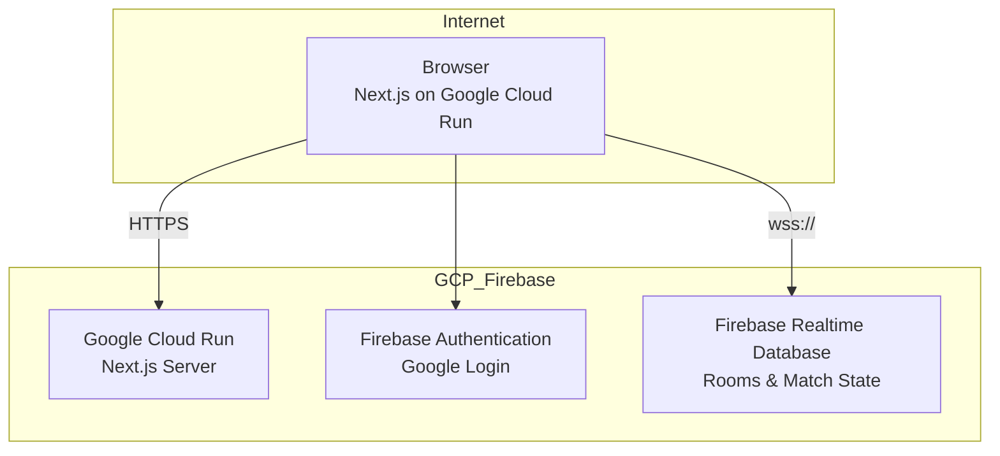

# システムアーキテクチャ

## 概要

麻雀パズル「paicrash」は **Next.js フロントエンド + Firebase Realtime Database** の構成です。ゲームロジックは `lib/` に集約し、マルチプレイのリアルタイム同期（牌面・スコア・勝敗）はサーバーレス環境（Firebase）で管理されます。

---

## 構成図

### Firebase / GCP 環境



**通信フロー：**
1. ブラウザ → Cloud Run (Next.js サーバーから初期HTML/JSをロード)
2. ブラウザ → Firebase Auth (Google認証)
3. ブラウザ → Firebase Realtime Database (WebSocket通信でゲーム状態を同期)

---

## レイヤー責務

| レイヤー | パス | 責務 |
|----------|------|------|
| ページ | `app/` | ルーティング相当の画面切替、ダイアログ |
| ゲーム UI | `components/game/` | ボード描画、操作、ロビー UI |
| UI プリミティブ | `components/ui/` | shadcn / Radix ベース（原則変更しない） |
| ゲームドメイン | `lib/game-engine.ts`, `mahjong-types.ts`, `yaku-data.ts` | 牌・マッチ・役・スコア |
| クライアント状態 | `lib/game-store.ts`, `multiplayer-store.ts` | Zustand ストア |
| 接続・同期 | `hooks/use-multiplayer.ts` | Firebase RTDB 接続、ルーム操作、同期フック |
| ゲームロジック | `lib/multiplayer-game-logic.ts` | 純粋関数によるゲーム状態変換 |
| Firebase設定 | `lib/firebase.ts` | Firebase SDK の初期化 |

---

## 主要データフロー

### シングルプレイ

```
ユーザー入力 → game-store (move/drop/tick)
            → game-engine (placeTile, findClearableGroups, clearTiles, applyGravity)
            → game-store 更新 → game-board.tsx 再描画
```

### マルチプレイ（Firebase同期型）

```
Client A/B → Firebase Realtime Database
  - セッション管理（Google Auth）
  - ルーム作成・参加・プレゼンス
  - ゲーム入力に伴うローカル状態計算（applyGameInput）
  - 計算結果を Firebase に同期（update）
  - ガベージ送信（Firebase経由で相手のキューに追加）
Client ← onValue イベント ← Firebase RTDB（状態同期）
```

---

## Firebase データベース構造

```json
{
  "rooms": {
    "roomId": {
      "id": "roomId",
      "name": "Room Name",
      "status": "waiting",
      "isStarted": false,
      "createdAt": 1234567890,
      "players": {
        "playerId": { "id": "playerId", "name": "Player 1", "isReady": true }
      },
      "match": {
        "status": "playing",
        "players": {
          "playerId": {
            "playerId": "playerId",
            "playerName": "Player 1",
            "gameState": { /* 盤面・スコア・落下中の牌など */ }
          }
        }
      }
    }
  }
}
```

---

## デプロイ

| 環境 | ホスティング | 備考 |
|------|--------------|------|
| フロントエンド | Google Cloud Run | Dockerfileでコンテナ化してデプロイ |
| データベース | Firebase Realtime Database | コンソールまたはFirebase CLIで管理 |
| 認証 | Firebase Authentication | Googleプロバイダ有効化 |
| インフラ CI/CD | GitHub Actions | `deploy.yml` にて Artifact Registry 経由で Cloud Run にデプロイ |

---

## ディレクトリマップ

```
app/
  layout.tsx, page.tsx, globals.css
components/
  game/          # ゲーム画面
  ui/            # 共通 UI
  icons/         # 麻雀アイコン
hooks/
  use-multiplayer.ts
  use-mobile.ts, use-toast.ts, use-yakuman-animation.ts
lib/
  game-engine.ts
  game-store.ts
  mahjong-types.ts
  yaku-data.ts
  multiplayer-store.ts
  multiplayer-protocol.ts
  multiplayer-game-logic.ts
  firebase.ts    # Firebase設定
  utils.ts
docs/            # 本ディレクトリ
public/
```
