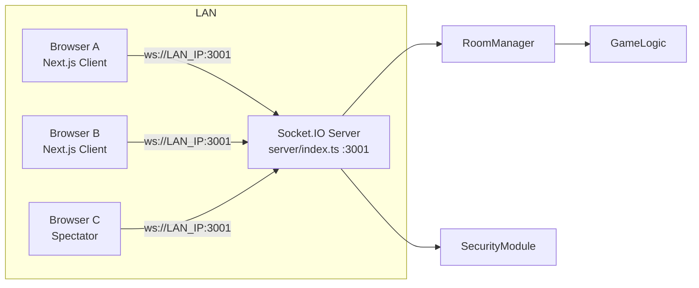
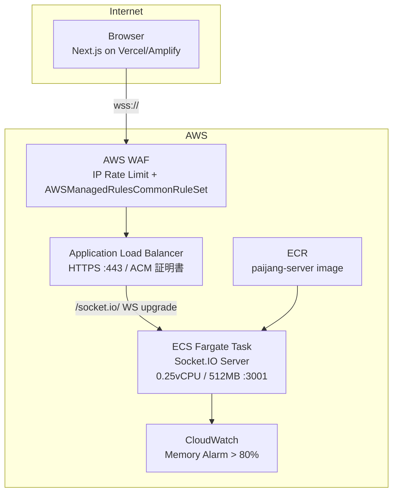

# システムアーキテクチャ

## 概要

麻雀パズルは **Next.js フロントエンド + Node.js Socket.IO サーバー** の構成です。ゲームロジックは `lib/` に集約し、マルチプレイの真実（牌面・スコア・勝敗）は `server/` が保持します。

---

## 構成図

### ローカル LAN 環境



### AWS 本番環境



**通信フロー：**
1. ブラウザ → WAF（IP レート制限・共通ルール適用）
2. WAF → ALB（HTTPS 443、ACM 証明書で TLS 終端）
3. ALB → ECS Task（HTTP/WebSocket、stickiness 有効）
4. ECS Task → CloudWatch（メモリ使用量メトリクス）

---

## レイヤー責務

| レイヤー | パス | 責務 |
|----------|------|------|
| ページ | `app/` | ルーティング相当の画面切替、ダイアログ |
| ゲーム UI | `components/game/` | ボード描画、操作、ロビー UI |
| UI プリミティブ | `components/ui/` | shadcn / Radix ベース（原則変更しない） |
| ゲームドメイン | `lib/game-engine.ts`, `mahjong-types.ts`, `yaku-data.ts` | 牌・マッチ・役・スコア |
| クライアント状態 | `lib/game-store.ts`, `multiplayer-store.ts` | Zustand ストア |
| 接続・同期 | `hooks/use-multiplayer.ts` | Socket.IO 接続、ルーム操作、同期フック |
| サーバー | `server/index.ts` | Socket.IO イベントルーター |
| ルーム管理 | `server/room-manager.ts` | セッション・ルーム・ゲームティック・勝敗判定 |
| セキュリティ | `server/security.ts` | レート制限・入力サニタイズ・トークン生成 |
| ゲームロジック（サーバー） | `lib/multiplayer-game-logic.ts` | 純粋関数によるゲーム状態変換 |
| インフラ | `cdk/` | AWS CDK（TypeScript）によるインフラ定義 |

---

## コンポーネント境界

| コンポーネント | 責務 | 依存 |
|---------------|------|------|
| `server/index.ts` | Socket.IO イベントのルーティング、ブロードキャスト | RoomManager, SecurityModule |
| `RoomManager` | セッション CRUD、ルーム CRUD、ゲームティック、勝敗判定 | GameLogic, SecurityModule |
| `SecurityModule` | 入力サニタイズ、トークン生成、レート制限、CORS オリジン解析 | node:crypto |
| `multiplayer-game-logic.ts` | 純粋関数によるゲーム状態変換（副作用なし） | mahjong-types, game-engine |
| `use-multiplayer.ts` | Socket.IO クライアント管理、イベント→Store 変換 | socket.io-client, multiplayer-store |
| `multiplayer-store.ts` | クライアント UI 状態（Zustand） | multiplayer-protocol |

---

## 主要データフロー

### シングルプレイ

```
ユーザー入力 → game-store (move/drop/tick)
            → game-engine (placeTile, findClearableGroups, clearTiles, applyGravity)
            → game-store 更新 → game-board.tsx 再描画
```

### マルチプレイ（サーバー権威型）

```
Client A/B → WebSocket → Server（権威）
  - セッション管理（sessionToken）
  - ルーム CRUD・プレゼンス
  - ゲーム入力（move-left/right/soft-drop/hard-drop）
  - ゲーム状態更新（applyGameInput）
  - ガベージ送信（queueGarbage）
  - 勝敗判定（evaluateWinner）
  - 自動落下ティック（setInterval）
Client ← match:state / match:ended ← Server（ブロードキャスト）
```

---

## Socket.IO イベント一覧

### Client → Server

| イベント | ペイロード | 説明 |
|---------|-----------|------|
| `session:create` | `{ playerName }` | 新規セッション作成 |
| `session:resume` | `{ sessionToken }` | セッション復元 |
| `room:create` | `{ sessionToken, roomName }` | ルーム作成 |
| `room:join` | `{ sessionToken, roomId }` | プレイヤー参加 |
| `room:spectate` | `{ sessionToken, roomId }` | 観戦参加 |
| `room:leave` | `{ sessionToken }` | ルーム退出 |
| `room:ready` | `{ sessionToken, isReady }` | 準備状態変更 |
| `room:start` | `{ sessionToken }` | 対戦開始（ホストのみ） |
| `chat:send` | `{ sessionToken, text }` | チャット送信 |
| `game:input` | `{ sessionToken, action }` | ゲーム入力 |

### Server → Client

| イベント | ペイロード | 説明 |
|---------|-----------|------|
| `session:created` | `SessionInfo` | セッション作成完了 |
| `session:resumed` | `SessionInfo + roomId + role` | セッション復元完了 |
| `room:list` | `PublicRoomListItem[]` | ルーム一覧更新 |
| `room:updated` | `PublicRoom` | ルーム状態更新 |
| `chat:message` | `ChatMessagePayload` | チャットメッセージ |
| `match:started` | `MatchSnapshot` | 対戦開始 |
| `match:state` | `MatchSnapshot` | ゲーム状態更新 |
| `match:ended` | `GameOverPayload` | 対戦終了 |
| `error` | `{ code, message }` | エラー通知 |

---

## AWS インフラ（CDK）

### CDK スタック構成

```
cdk/
├── bin/app.ts          # CDK App エントリポイント
├── lib/
│   ├── infra-stack.ts  # VPC, ECR, ACM, WAF（変更頻度低）
│   └── app-stack.ts    # ECS, ALB, CloudWatch（デプロイ頻度高）
└── cdk.json
```

| スタック | リソース | 変更頻度 |
|---------|---------|---------|
| InfraStack | VPC（パブリック 2AZ）、ECR、ACM 証明書、WAF WebACL | 低 |
| AppStack | ECS Fargate（0.25vCPU/512MB）、ALB、CloudWatch Alarm | 高 |

### セキュリティグループ

- **ALB SG**：インバウンド HTTPS (443) のみ許可（0.0.0.0/0）
- **ECS Task SG**：インバウンドは ALB SG からのみ許可（ポート 3001）

---

## 状態管理の分離

| ストア | 用途 | 混線防止 |
|--------|------|----------|
| `game-store.ts` | 盤面、落下牌、スコア、ポーズ | マルチ中も自プレイヤー盤面に使用。リセットタイミングを明示 |
| `multiplayer-store.ts` | 接続、ルーム、チャット、ガベージキュー | シングルプレイ時は `reset()` でクリア |

---

## 環境変数

| 変数名 | スコープ | ローカル値 | AWS 値 |
|--------|---------|-----------|--------|
| `PORT` | Server | `3001` | `3001` |
| `ALLOWED_ORIGINS` | Server | `http://localhost:3000` | `https://your-app.vercel.app` |
| `NEXT_PUBLIC_SOCKET_URL` | Client | `http://localhost:3001` | `wss://api.your-domain.com` |

ローカル LAN 環境では `NEXT_PUBLIC_SOCKET_URL=http://192.168.x.x:3001` のように LAN IP を指定することで同一ネットワーク内の対戦が可能。

---

## デプロイ

| 環境 | ホスティング | 備考 |
|------|--------------|------|
| フロントエンド | Vercel または AWS Amplify | `pnpm build` / `pnpm start` |
| Socket.IO サーバー | AWS ECS Fargate | `Dockerfile` でコンテナ化、ECR に格納 |
| インフラ | AWS CDK (TypeScript) | `cdk/` ディレクトリで管理 |

---

## ディレクトリマップ

```
app/
  layout.tsx, page.tsx, globals.css
components/
  game/          # ゲーム画面
  ui/            # 共通 UI
  icons/         # 麻雀アイコン
hooks/
  use-multiplayer.ts
  use-mobile.ts, use-toast.ts
lib/
  game-engine.ts
  game-store.ts
  mahjong-types.ts
  yaku-data.ts
  multiplayer-store.ts
  multiplayer-protocol.ts
  multiplayer-game-logic.ts
  utils.ts
server/
  index.ts       # Socket.IO サーバー
  room-manager.ts
  security.ts
cdk/             # AWS CDK インフラ定義
  bin/app.ts
  lib/infra-stack.ts
  lib/app-stack.ts
docs/            # 本ディレクトリ
public/
```
